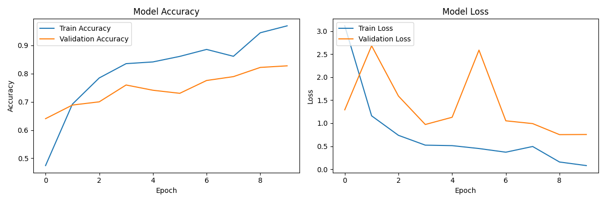
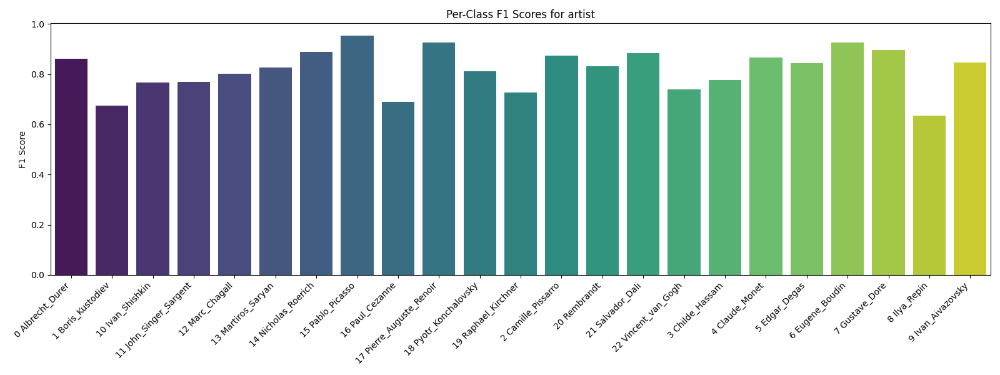
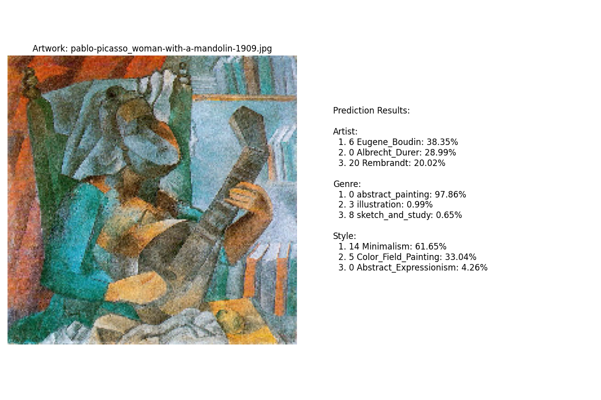

# 🎨 CNN-RECURRENT Based Art Classification with ArtGAN Dataset  

## 📜 Abstract  
With the advancement of deep learning models, particularly in computer vision, AI models have demonstrated remarkable proficiency in capturing complex patterns and features in artwork. This project explores the classification of artwork into **Artist**, **Style**, and **Genre** using a custom **CNN-GRU (Convolutional Neural Network + Gated Recurrent Unit)** architecture. The focus is on maximizing classification accuracy through advanced feature extraction, data augmentation, and optimized training strategies.  

---  

## 🔎 Approach  

### 📂 Data  
The dataset is sourced from the **ArtGan** repository and consists of images of paintings, which are organized into three classification categories: **Artist**, **Style**, and **Genre**.  
- The dataset is structured into two main folders:  
  - `wikiart/` → Contains images organized by artist, style, and genre.  
  - `wikiart_csv/` → Contains CSV files for training, validation, and class labels.  
- Dataset statistics:  
  - **Artist**: 13,345 training, 5,705 validation → 23 unique labels  
  - **Genre**: 45,502 training, 19,491 validation → 10 unique labels  
  - **Style**: 57,024 training, 24,420 validation → 27 unique labels
---

## 📁 Directory Structure  
```plaintext
├── Art_Extract_Test1.ipynb        # Main code
├── wikiart/                       # Image dataset
├── wikiart_csv/                   # CSV files for labels and metadata
├── models/                        # Trained models 
├── results/                       # Output and outlier images
└── README.md                      # Project Documentation
```
---
# 🖼️ Data Preprocessing for Artwork Classification  

This repository contains code for preprocessing artwork classification datasets, including label encoding, class balancing, and task-specific data augmentation. The preprocessing pipeline is optimized for training deep learning models on artwork datasets using TensorFlow and EfficientNet.  

---

## 🚀 **Features**  
Resizes all images to **(224, 224)** using TensorFlow's `tf.image.resize` for consistency.  
Applies **normalization** using `tf.keras.applications.efficientnet.preprocess_input` to improve convergence during training.  
Handles **class-specific augmentations** based on the task (style, artist, genre):  
- **Style:** Horizontal flip, brightness adjustment, contrast adjustment, saturation adjustment, and random cropping to account for visual variance in styles.  
- **Artist:** Horizontal flip, brightness adjustment, contrast adjustment, and saturation adjustment to handle variations in artistic technique.  
- **Genre:** Horizontal flip, brightness adjustment, contrast adjustment, saturation adjustment, and conditional random cropping to manage diverse genre characteristics.  
 Handles **unknown labels** in the dataset by filtering out classes not defined in the class list.  
 Computes **class weights** using `compute_class_weight` to balance class distribution during training.  

---

## 🏗️ **Structure**  

# Art Classification Deep Learning System

Advanced deep learning system for artwork classification across three domains: artist, style, and genre. Features task-specific architectures and optimized training strategies.It is primarily based on EfficientNetB2 model trained on imagenet with a connected CNN architecture different for each of the 3 components .It was choosen for its efficiency and accuracy and to reduce machine load.The image trained in 2 phases with initial frozen layers and then fine-tuned further.The model also incorporate focal loss and cosine annealing for learnin grate and loss and adam as optimiser.It also incorporates different callbacks for better training .It is also has a the capability to subset the database based on usage. 

## 🧠 Model Architecture

### Base Network
EfficientNetB2(weights='imagenet', include_top=False)
- **Input**: 224x224 or 300x300 RGB images
- **Layer Freezing Strategy**:
  | Task   | Frozen Layers | Trainable Layers |
  |--------|---------------|-------------------|
  | Artist | First 40      | Last 40+         |
  | Style  | First 30      | Last 30+         |
  | Genre  | First 60      | Last 60+         |

### Task-Specific Heads
| Task   | Architecture Features                          | Regularization           |
|--------|------------------------------------------------|--------------------------|
| Artist | - 1536D Residual Block                         | Dropout (0.4-0.3)        |
|        | - Squeeze-Excitation                           |                          |
|        | - 768D Layer                                   |                          |
| Style  | 1024D → 512D → 256D Stack                      | Dropout (0.3-0.2)        |
| Genre  | 1024D → 512D → 256D Stack                      | Dropout (0.3-0.2)        |


### 🎯 Optimization Configuration
| Task   | Learning Rate Schedule              | Weight Decay | Loss Function       |
|--------|-------------------------------------|--------------|---------------------|
| Artist | Cosine Annealing (5e-4, T=2000)    | 1e-5         | Focal Loss (γ=2.0)  |
| Style  | Cosine Annealing (2e-3, T=1000)    | 1e-5         | Focal Loss (α=0.25) |
| Genre  | Exponential Decay (5e-4 → -2%)     | 1e-5         | Focal Loss (γ=2.0)  |

### For Detailed architecture
[[Artist model](results/model_architecture_artist.png)],[[Genre Model](results/model_architecture_genre.png)],[[Style model](results/model_architecture_style.png)]

## 📂 Model Saving
Best models automatically saved to:
```
models/
├── best_model_artist.keras
├── best_model_style.keras
└── best_model_genre.keras
```
---

## ✔Evaluation Metrics 
Performance evaluation is conducted through both visual and quantitative means to provide a comprehensive assessment of the model's effectiveness. This dual approach ensures a well-rounded evaluation, providing both visual and numerical measures to assess the performance. 

**[1] Visualisation**

 The visual assessment involves showcasing the image outliers and also visualization of each of the metrics written below.You can see the vizualization in the results folder and the accuracy and loss in the repo directly.
 [[Results](results)]
 -example 
   
   

### Key Evaluation Metrics
| Metric                  | Implementation                          | Output File                     |
|-------------------------|-----------------------------------------|---------------------------------|
| Model Architecture      | `plot_model` with layer visualization   | `model_architecture_{TASK}.png` |
| Accuracy & F1 Score     | `accuracy_score`, `f1_score`            | Console output                  |
| Confusion Matrix        | Seaborn heatmap                         | `confusion_matrix_{TASK}.png`   |
| Classification Report   | `classification_report`                 | `classification_report_{TASK}.txt` |
| Per-Class F1 Scores     | Seaborn barplot                         | `f1_scores_{TASK}.png`          |
| Outlier Detection       | Low-confidence & misclassified samples  | Console output                  |


### Output Features
- **Visual Reports**: Architecture diagram, confusion matrix, F1 distribution
- **Text Reports**: Detailed classification metrics
- **Outlier Identification**: Combined low-confidence (<0.5) and misclassified samples


## 👀 Results Analysis  
### 1. Artist Classification

#### Key Observations:
- **High Accuracy (70-95%) for most artists**  
  - Distinct styles (e.g., Van Gogh's brushstrokes) are well-learned  

- **Low Accuracy Cases**:
  - Ilya_Repin (58.7%)
  - Boris_Kustodiev (67.7%) 
  **Causes**:
  - Limited training samples for underrepresented artists
  - Style overlap with similar realist painters

- **Cubist Misclassification**:

  # Prediction Example
  true_artist = "Pablo_Picasso"
  predicted = {
      "Eugene_Boudin": 38.4,  # % confidence
      "Albrecht_Durer": 29.0,
      "Rembrandt": 20.0
  }

  **Root Causes**:
  - It has been trained on more traditional Picasso paintings .
  - Cubism’s abstract geometry differs significantly from other styles in the dataset.

### 2. Genre Classification

Moderate Overall Accuracy (75%) but Poor F1 Scores:
#### Performance Issues:
- **Dominant Classes Bias**:
- Class Imbalance: Common genres (cityscape, genre_painting) dominate, so the model biases toward them.
- Ambiguous Cases: Some abstract paintings resemble illustrations or sketches, leading to misclassifications.

- **Near-Zero F1 Scores** for:
  - `religious_painting` (0.00)
  - `still_life` (0.01)
  - Rare genres (religious_painting, still_life) have too few examples for the model to learn meaningful features.

### 3. Style Classification
Extremely Low Accuracy (7%) and F1 (0.04 avg):

#### Failure Analysis:
- **Granularity Problems**:
- Too Many Fine-Grained Styles: Classes like Analytical Cubism vs. Synthetic Cubism are hard even for experts to distinguish.
- Severe Data Imbalance: Some styles (Action_painting) have only 9 samples, making learning impossible.
- Label Noise: Art styles are subjective—some paintings may be mislabeled in training.

- **Minimalism vs. Cubism Confusion**:

  # Misclassification Case
   
  true_style = "Cubism"
  predicted = {
      "Minimalism": 0.62,  # Probability
      "Color_Field_Painting": 0.33
  }

  **Visual Similarities**:
  - The model confuses geometric abstraction (Cubism) with Minimalism due to overlapping visual features (simplified forms, flat colors).

## Key Challenges

| Issue | Impact | Solution Path |
|-------|--------|---------------|
| Class Imbalance | Biases toward majority classes | Oversampling + weighted loss |
| Style Granularity | Unlearnable distinctions | Label consolidation |
| Cubist Features | Fails on abstract works | Attention mechanisms |

## Next Steps

improvement_roadmap = [
    "Merge similar style labels",
    "Augmentming rare genre samples",
    "Adding class-specific training data",
    "Implementing Grad-CAM for error analysis"
]


> **Note**: Full confusion matrices and training curves available in `/results`

## 🔨 Possible Improvements  
Was not able to implement most of these improvements mainly due to the need of stopping the model training halfway through because of college and travel.Would love to improve more on the model if given a chance also feel free to list any improvements that you may feel the project is lacking or any part that can be improved.
1. **Enhanced Image Processing**  
   - Adding better or diffferent pre processing to see how the results turn out even more optimised for each model.  
2. **Alternative Architectures**  
   - Exploring alternative architectures such as CNNs, transformers, autoencoders, or U-Nets could facilitate more comprehensive extraction of hidden image features.
   - As existing model showed poor predictione in scenarios where classes are undersampled also as it is typically trained on photographs of humans rather than 2D paintings(imagenet). Consequently, fine-tuning these models using a painting dataset, accompanied by ground truth labels for facial regions, would likely improve performance and accuracy.

3. **Fine - Tuning Hyperparameters further**  
   - I would still like to test more optimizers,models,epochs,lr and callbacks to find the most appropriate one, 
4. **Contrastive Learning**  
   - Use contrastive loss to improve separation between similar and dissimilar images.
5. **Sampling**  
   - I would like to use a library called smote to increase the samples for the undersampled class to reduce data imbalance and increase f1 score as well as actual accuracy.
6. **Improving on the prediction function**  
   - By increasing threshold and trying to increase confidence level
  

 ---
## 📦 Dependencies
- TensorFlow 2.8+
- EfficientNetB2
- NumPy
- scikit-learn
- Matplotlib (visualizations)
- seaborn for visualization
- scikit-learn metrics
- Pandas
- OS
- Math
